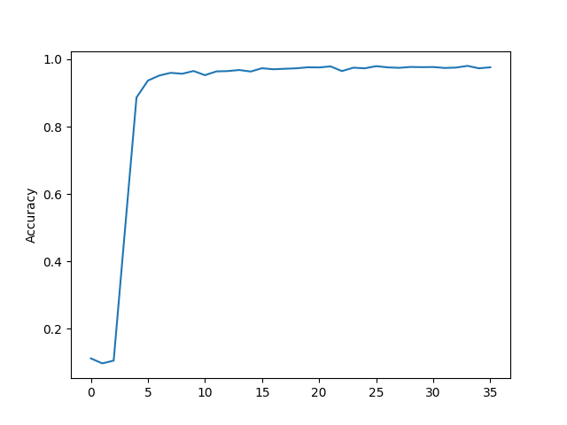

# MiniGrad — Tiny NumPy Autograd + MNIST

From-scratch automatic differentiation engine (computational graph + backprop) in **pure NumPy**, plus a minimal NN stack to train an MLP on MNIST—no PyTorch/TF. A default run reaches **~96–97%** validation accuracy in a few epochs.



## Quick Start
```bash
uv run python run_mnist.py
